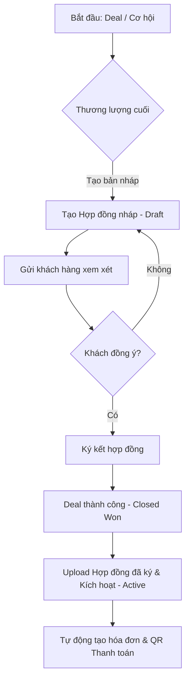

# Hướng dẫn Thiết kế & Triển khai Hệ thống Quản lý Hợp đồng (CRM)

Tài liệu này cung cấp thiết kế kiến trúc hoàn chỉnh, phân quyền và quy trình nghiệp vụ cho tính năng **Hợp đồng (Contract)** trong ứng dụng CRM React + Firebase hiện tại.

---

## 1. Hợp đồng dùng để làm gì? (Mục đích)

Trong hệ thống CRM, **Hợp đồng (Contract)** là văn bản pháp lý ràng buộc giữa doanh nghiệp của bạn và khách hàng. Hợp đồng phục vụ các mục đích cốt lõi sau:

*   **Tính Pháp Lý & Bảo Vệ:** Lưu trữ các cam kết, điều khoản dịch vụ, phạm vi công việc (Scope of Work - SOW) để giải quyết tranh chấp nếu có.
*   **Kích Hoạt Dịch Vụ:** Làm căn cứ để bộ phận vận hành (Operations/Support) bắt đầu triển khai sản phẩm/dịch vụ cho khách hàng.
*   **Ghi Nhận Doanh Thu & Thanh Toán:** Liên kết trực tiếp với các đợt thanh toán (Milestones), hóa đơn (Invoices) và các cổng thanh toán tự động (như SePay QR đã tích hợp).
*   **Theo Dõi & Gia Hạn:** Tự động nhắc nhở (Reminders) khi hợp đồng sắp hết hạn để Sales liên hệ tái ký.

---

## 2. Quy trình & Thời điểm tạo (Khi nào & Tạo thế nào?)



### 2.1. Khi nào tạo? (When)
*   **Thời điểm tạo nháp:** Khi một **Deal (Cơ hội)** tiến đến giai đoạn cuối cùng là **Thương lượng/Đàm phán (Negotiation)**.
*   **Thời điểm kích hoạt:** Khi hợp đồng đã được hai bên ký kết (ký số hoặc ký tay đóng dấu). Lúc này Deal sẽ được chuyển sang trạng thái **Closed Won (Chốt thành công)**.

### 2.2. Làm sao để tạo? (How)
Có **2 phương thức** tạo hợp đồng tối ưu trên hệ thống:

| Phương thức | Chi tiết thực hiện | Ưu điểm |
| :--- | :--- | :--- |
| **Cách 1: Upload thủ công (Manual Upload)** | 1. Sales chuẩn bị hợp đồng bản giấy/file Word ngoài hệ thống.<br>2. Hai bên ký tên, đóng dấu và scan thành file PDF.<br>3. Sales tạo mới Hợp đồng trên CRM, điền thông tin cơ bản và kéo thả bản scan tải lên **Firebase Storage**. | Đơn giản, linh hoạt với mọi loại hợp đồng đặc thù. |
| **Cách 2: Tự động tạo bản mềm (Auto-generate PDF)** | 1. Tận dụng thư viện `@react-pdf/renderer` (giống phần Invoices).<br>2. Hệ thống thiết lập sẵn một **Hợp đồng mẫu (Template)** chuẩn.<br>3. Nhấn nút "Tạo hợp đồng tự động" từ Deal/Customer.<br>4. CRM tự động lấy thông tin từ Firestore (Tên KH, Đại diện, Giá trị Deal...) điền vào template, xuất ra PDF, tự động lưu lên **Firebase Storage** và gửi mail cho KH qua **Resend**. | Tiết kiệm thời gian, chuyên nghiệp, chuẩn hóa quy trình. |

---

## 3. Vai trò & Phân quyền (Who & Roles)

Để bảo mật các tài liệu pháp lý và thông tin tài chính nhạy cảm, quyền hạn được chia chặt chẽ dựa trên các Role sẵn có của hệ thống (`admin`, `manager`, `sales`):

### Bảng phân quyền chi tiết (Matrix Permissions)

| Hành động | Sales (Nhân viên) | Manager (Quản lý) | Admin (Quản trị viên) |
| :--- | :--- | :--- | :--- |
| **Xem danh sách & chi tiết** | Chỉ xem hợp đồng của **khách hàng mình được gán phụ trách** | Xem toàn bộ hợp đồng của công ty | Xem toàn bộ hợp đồng của công ty |
| **Tạo mới (Draft/Active)** | Được phép tạo (Gán mặc định phụ trách) | Được phép tạo | Được phép tạo |
| **Chỉnh sửa thông tin** | Được sửa hợp đồng của mình (khi ở trạng thái *Draft*) | Được sửa toàn bộ hợp đồng | Được sửa toàn bộ hợp đồng |
| **Phê duyệt / Kích hoạt** | Không được tự ý duyệt (Phải gửi yêu cầu phê duyệt) | Được quyền chuyển sang *Active* | Được quyền chuyển sang *Active* |
| **Tải lên / Thay file PDF** | Được upload file cho hợp đồng của mình | Được upload mọi file | Được upload mọi file |
| **Xóa vĩnh viễn** | **KHÔNG ĐƯỢC PHÉP** | **KHÔNG ĐƯỢC PHÉP** | **ĐƯỢC PHÉP** (Quyền duy nhất) |

---

## 4. Kiến trúc Dữ liệu trên Firebase

### 4.1. Cấu trúc Firestore (Collection: `contracts`)

Mỗi hợp đồng sẽ lưu dưới dạng một Document trong Firestore để dễ quản lý, tìm kiếm và liên kết:

```typescript
interface Contract {
  id: string;                    // Document ID tự động tạo bởi Firestore
  contractNumber: string;        // Số hợp đồng (Ví dụ: HĐ-2026-05-001)
  title: string;                 // Tiêu đề (Ví dụ: Hợp đồng cung cấp dịch vụ CRM)
  
  // Liên kết (Relations)
  customerId: string;            // ID khách hàng từ collection 'customers'
  customerName: string;          // Tên khách hàng (để query/hiển thị nhanh)
  dealId?: string;               // ID thương vụ liên quan từ collection 'deals'
  dealTitle?: string;            // Tên thương vụ (nếu có)
  
  // Tài chính & Thời gian
  value: number;                 // Giá trị hợp đồng (VND)
  startDate: Timestamp;          // Ngày bắt đầu có hiệu lực
  endDate: Timestamp;            // Ngày hết hạn
  signedDate?: Timestamp;        // Ngày ký kết thực tế
  
  // Trạng thái hợp đồng
  status: 'draft' | 'pending_signature' | 'active' | 'expired' | 'terminated';
  
  // Tệp đính kèm (Lưu trữ trên Firebase Storage)
  fileUrl?: string;              // Đường dẫn tải file PDF/Word hợp đồng
  fileName?: string;             // Tên tệp tin gốc tải lên
  
  // Quản lý nhân sự
  createdById: string;           // ID người tạo hợp đồng
  createdByName: string;         // Tên người tạo
  assignedTo: string;            // Sales phụ trách theo dõi hợp đồng này (thường đồng bộ với assignedTo của khách hàng)
  
  notes?: string;                // Ghi chú thêm
  createdAt: Timestamp;          // Ngày tạo record trên hệ thống
  updatedAt: Timestamp;          // Ngày cập nhật gần nhất
}
```

### 4.2. Cấu trúc thư mục lưu trữ (Firebase Storage)

File hợp đồng nên được lưu trong thư mục riêng biệt theo ID của khách hàng để dễ quản lý:
`contracts/{customerId}/{contractId}_{fileName}`

### 4.3. Luật bảo mật Firebase (Firestore & Storage Rules)

Cần cập nhật các quy tắc bảo mật để đảm bảo tính riêng tư dữ liệu:

#### Cập nhật `firestore.rules`:
```javascript
// --- Rules cho collection 'contracts' ---
match /contracts/{contractId} {
  // Đọc: Admin, Manager xem tất cả. Sales chỉ xem hợp đồng gán cho mình
  allow read: if isAdmin() || isManager() || (isAuthenticated() && resource.data.assignedTo == request.auth.uid);
  
  // Tạo: Cho phép mọi user đã đăng nhập, tự động gán assignedTo
  allow create: if isAuthenticated() && (isAdmin() || isManager() || request.resource.data.assignedTo == request.auth.uid);
  
  // Sửa: Admin/Manager sửa tất cả. Sales chỉ sửa hợp đồng nháp của mình
  allow update: if isAdmin() || isManager() || 
    (isAuthenticated() && resource.data.assignedTo == request.auth.uid && resource.data.status == 'draft');
    
  // Xóa: Duy nhất Admin được xóa hợp đồng
  allow delete: if isAdmin();
}
```

#### Cập nhật `storage.rules` (đã có khung cơ bản, tối ưu hóa thêm):
```javascript
match /contracts/{customerId}/{allPaths=**} {
  // Chỉ cho phép đọc nếu đã đăng nhập và là Admin/Manager hoặc chính Sales phụ trách khách hàng này
  allow read: if request.auth != null && (
    isAdmin() || 
    isManager() || 
    firestore.get(/databases/(default)/documents/customers/$(customerId)).data.assignedTo == request.auth.uid
  );
  
  // Cho phép upload file mới
  allow write: if request.auth != null && (
    isAdmin() || 
    isManager() || 
    firestore.get(/databases/(default)/documents/customers/$(customerId)).data.assignedTo == request.auth.uid
  );
  
  // Chỉ Admin mới được xóa file hợp đồng đã tải lên
  allow delete: if isAdmin();
}
```

---

## 5. Thiết kế Giao diện UI (User Experience)

Để mang lại trải nghiệm chuyên nghiệp và đồng bộ với giao diện hiện tại của bạn, tính năng hợp đồng nên xuất hiện tại **3 nơi chính**:

### 5.1. Tab "Hợp đồng" trong Chi tiết Khách hàng (`CustomerProfile.tsx`)
*   Hiển thị danh sách tất cả hợp đồng của khách hàng này.
*   Cột trạng thái hiển thị bằng màu sắc (Badge): `Draft` (Xám), `Pending` (Vàng), `Active` (Xanh lá), `Expired` (Đỏ).
*   Có nút **"Tạo hợp đồng"** (Upload file hoặc Auto-generate).
*   Xem trực tiếp hoặc tải xuống file PDF hợp đồng một cách nhanh chóng.

### 5.2. Tích hợp trong Cập nhật Cơ hội (`DealModal.tsx`)
*   Khi chuyển Deal sang giai đoạn **"Chốt hợp đồng / Negotiation"**, giao diện hiển thị thêm mục đính kèm hoặc liên kết hợp đồng nháp.
*   Khi Deal chuyển sang **"Closed Won"**, hệ thống yêu cầu xác nhận/upload file hợp đồng đã ký trước khi hoàn tất chuyển giai đoạn.

### 5.3. Trang Quản lý Hợp đồng Tập trung (Dành cho Admin/Manager)
*   Một menu mới bên thanh Sidebar: **Quản lý Hợp đồng**.
*   Bộ lọc nhanh: Hợp đồng sắp hết hạn (trong 30 ngày tới), hợp đồng chờ duyệt ký, hợp đồng có giá trị cao nhất.
*   Thống kê tổng giá trị hợp đồng đang hoạt động (MRR/ARR hoặc Tổng doanh số ký kết).

---

## 6. Kế hoạch Triển khai (Roadmap 3 Bước)

> [!NOTE]
> Bạn có thể bắt đầu với **Bước 1 (Upload thủ công)** để nhanh chóng đưa tính năng vào sử dụng, sau đó cải tiến dần lên **Bước 2** và **Bước 3**.

1.  **Bước 1: Thiết lập nền tảng cơ bản (Mất ~1 ngày)**
    *   Cấu hình Firestore collection `contracts` và cập nhật rules bảo mật (`firestore.rules`, `storage.rules`).
    *   Tạo form tạo hợp đồng đơn giản bằng cách điền thông tin và tải file scan lên Storage.
2.  **Bước 2: Tích hợp vào UI chính (Mất ~2 ngày)**
    *   Thêm tab Hợp đồng vào trang `CustomerProfile.tsx`.
    *   Tạo modal thêm/sửa hợp đồng và gắn file PDF.
    *   Cho phép tải trực tiếp file hợp đồng từ giao diện.
3.  **Bước 3: Tự động hóa quy trình (Mất ~2 ngày)**
    *   Xây dựng file template hợp đồng bằng `@react-pdf/renderer` (tương tự Invoices).
    *   Tích hợp nút **"Tự động tạo & Gửi email hợp đồng nháp"** cho khách hàng.
    *   Liên kết trạng thái hợp đồng với cổng thanh toán SePay QR để khi khách thanh toán thành công, hợp đồng tự động chuyển sang `Active`.
